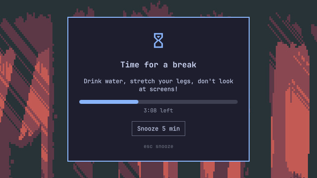
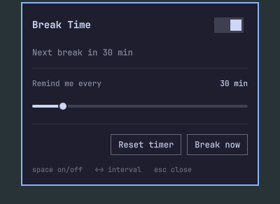

# Break Time

A break reminder for [Omarchy](https://omarchy.org). After 30 minutes at the
keyboard a small card asks you to drink water and stretch your legs. A bar
fills over the 5-minute break. Snooze it if now is a bad moment.



## Features

- **Counts real screen time.** Walk away for 5 minutes and the timer starts
  over when you come back. Short pauses to read or think still count.
- **One icon in the bar.** Click it for the on/off switch and the interval
  slider (15 to 120 minutes).
- **Quiet.** No fullscreen takeover, no sound, no network. The card sits in
  the middle of every screen and waits for you.
- **Themed.** Colours, font and borders follow the active Omarchy theme.
- **Native.** QML inside the `omarchy-shell` process you already run.

## Install

```bash
omarchy plugin add https://github.com/mjasnikovs/omarchy-breaktime.git --enable
```

The icon lands on the right of the bar. Move it with `omarchy bar move`.

> Plugins run unsandboxed inside your shell. Read the code before you enable it.

## Usage



| Action | How |
|---|---|
| Open settings | Click the hourglass in the bar |
| Turn on or off | Toggle in the panel, or Space while it is open |
| Change interval | Drag the slider, or Left / Right while the panel is open |
| Reset the timer | "Reset timer" in the panel |
| Start a break now | "Break now" in the panel, or middle-click the icon |
| Snooze 5 minutes | "Snooze 5 min" on the card, or Esc |

Keys on the card work after you click it. The card never steals focus from
what you are typing.

### How it behaves

- When the 5-minute bar is full, the card closes and the next interval starts.
- Turning the plugin off or on starts the timer over. Off also closes an
  open card.
- The card waits while the screen is locked and shows once you unlock.
- After suspend, a reminder that is more than 5 minutes overdue is dropped
  and a fresh interval starts.
- Snooze as many times as you like.
- The timer survives a shell restart. If the card was up, it comes back.
- A playing video does not pause the timer. Watching is screen time too.

## Settings

Stored in `~/.config/omarchy/shell.json` on the widget entry:

```json
{ "id": "mjasnikovs.breaktime", "enabled": true, "intervalMinutes": 30 }
```

Timer state lives in `~/.local/state/omarchy/breaktime/state.json`. That is
the only other file the plugin writes.

## Scripting

```bash
omarchy-shell mjasnikovs.breaktime status      # JSON: status, seconds left, break seconds left
omarchy-shell mjasnikovs.breaktime breakNow
omarchy-shell mjasnikovs.breaktime snooze
omarchy-shell mjasnikovs.breaktime reset
omarchy-shell mjasnikovs.breaktime enable
omarchy-shell mjasnikovs.breaktime disable
omarchy-shell mjasnikovs.breaktime interval 45
```

## Update

```bash
omarchy plugin update mjasnikovs.breaktime
omarchy restart shell
```

The card is kept loaded, so new card code needs the restart.

## Remove

```bash
omarchy plugin remove mjasnikovs.breaktime
rm -rf ~/.local/state/omarchy/breaktime
```

The first line disables the plugin and deletes its files. The second removes
the timer state.

## Requirements

- Omarchy 4 (Quattro) with the Quickshell-based `omarchy-shell`.
- No other runtime dependencies. No network access. Two subprocesses, both
  plain argument lists: `mkdir -p` for the state folder once at startup, and
  `omarchy-shell lock isLocked` when a reminder comes due.
- [bun](https://bun.sh) only for development.

## Development

Clone the repo somewhere outside `~/.config/omarchy/plugins` (the shell
refuses folders with symlinks, and `node_modules` has some).

```bash
bun install
bun run lint        # prettier, eslint --fix, tsc
bun test            # bun test on src/Model.mts
bun run build       # emits Model.mjs, which the QML imports
bun run prepublish  # check + build + validate the clean tree
```

`src/Model.mts` holds all the scheduling logic and has no Qt dependency. The
built `Model.mjs` is committed because `omarchy plugin add` clones the raw
repo with no build step. Run `bun run prepublish` before every push.

## License

[MIT](LICENSE)
